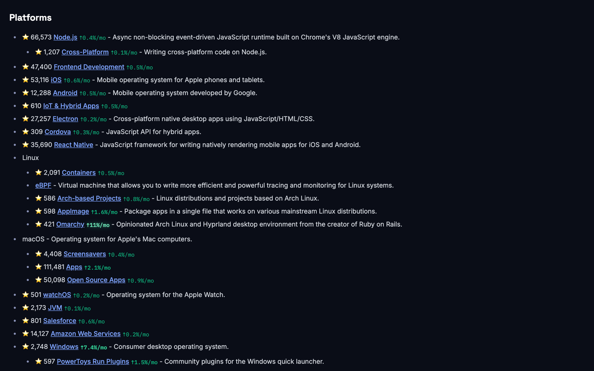
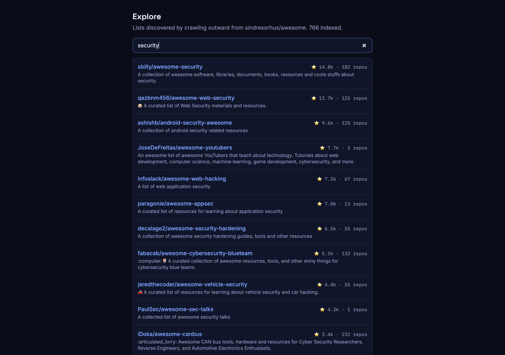
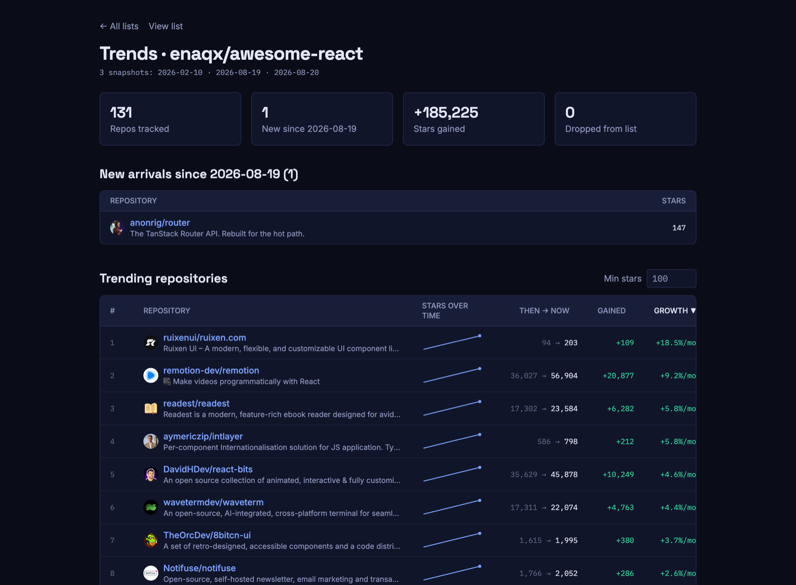

# Awesome Stars

**Awesome lists, rendered live with GitHub star counts and growth trends.**

### → [subev.github.io/awesome-stars](https://subev.github.io/awesome-stars/)

766 awesome lists, discovered by crawling outward from
[sindresorhus/awesome](https://github.com/sindresorhus/awesome). Every README is
fetched live from GitHub, so it is never stale — the star counts and `%/month`
growth badges are overlaid from a weekly crawl.

[](https://subev.github.io/awesome-stars/awesome/sindresorhus/awesome/#platforms)

<sub>Star counts and `%/month` growth overlaid on the real README, fetched live from GitHub.</sub>

## Jump in

| List | | |
|---|---|---|
| [Awesome](https://subev.github.io/awesome-stars/awesome/sindresorhus/awesome) — the list of lists | 672 repos | [trends](https://subev.github.io/awesome-stars/awesome/sindresorhus/awesome/trends) |
| [Awesome Python](https://subev.github.io/awesome-stars/awesome/vinta/awesome-python) | 476 repos | |
| [Awesome Go](https://subev.github.io/awesome-stars/awesome/avelino/awesome-go) | 2,806 repos | |
| [Awesome Self-Hosted](https://subev.github.io/awesome-stars/awesome/awesome-selfhosted/awesome-selfhosted) | 1,114 repos | |
| [Awesome Mac](https://subev.github.io/awesome-stars/awesome/jaywcjlove/awesome-mac) | 645 repos | |
| [Awesome Node.js](https://subev.github.io/awesome-stars/awesome/sindresorhus/awesome-nodejs) | 526 repos | [trends](https://subev.github.io/awesome-stars/awesome/sindresorhus/awesome-nodejs/trends) |
| [Awesome React](https://subev.github.io/awesome-stars/awesome/enaqx/awesome-react) | 131 repos | [trends](https://subev.github.io/awesome-stars/awesome/enaqx/awesome-react/trends) |

Or **[search all 766 lists](https://subev.github.io/awesome-stars/)** from the
Explore box on the homepage.

Every list — in Explore, on your homepage, or while you are reading it — carries
a ♥ to keep it on your homepage (stored in your browser) and a GitHub link to
open the real repo, so you can star it there too.

### Search all 766 lists

[](https://subev.github.io/awesome-stars/)

### Growth trends per list

[](https://subev.github.io/awesome-stars/awesome/enaqx/awesome-react/trends)

A **trends** page ranks a list's repos by growth, with sparklines and a
"dropped from the list" log. It needs two datapoints at least 14 days apart, so
more lists gain one every week as the crawl runs.

## FAQ

**How often is the data updated?**
A GitHub Action runs every 6 hours. Each run refreshes any list it has not seen
for 7 days, so **every list is re-fetched about once a week**. Runs in between
find nothing stale and exit in about a minute.

**How often do the growth badges change?**
A history datapoint is recorded at most once every 7 days. A percentage needs
two datapoints at least **14 days** apart, so a newly crawled list shows plain
star counts for roughly two weeks, then gains a `%/month` badge that updates
weekly after that.

**What does `↑2.1%/mo` mean?**
Average growth **per month**, not month-over-month and not "since the last
crawl". It is total growth since the repo was first observed, divided by the
elapsed months. Windows shorter than 14 days show no percentage at all —
extrapolating a single day would report a repo that gained 0.7% as `+21%/mo`.

**Are the star counts live?**
No — they are from the most recent crawl, and the page shows that date. The
**README is** live: it is fetched from GitHub the moment you open the page, so
list content is never stale even when the numbers are a few days old.

**My list is not here / is out of date.**
The crawl walks outward from [sindresorhus/awesome](https://github.com/sindresorhus/awesome)
up to 3 hops, skipping archived repos and, past the first hop, anything under 50
stars. Open an issue and it can be seeded directly.

**Does this hammer the GitHub API?**
No. A full pass over ~766 lists and ~85k repositories costs about **1,800 of the
5,000 hourly rate-limit points**, because star counts are batched 40-per-query
via GraphQL. READMEs come from `raw.githubusercontent.com`, which is unmetered.

## How it works

- **Markdown and stars come from different places.** The README is fetched live
  from GitHub in the browser; star counts come from a static JSON built at
  deploy time. Two requests per page, no server.
- **Stars are collected in batches.** One GraphQL query carries 40 aliased
  `repository()` lookups and costs GitHub *one* rate-limit point regardless of
  size — so 85k lookups cost ~1,800 points instead of 85,000. READMEs come from
  `raw.githubusercontent.com`, which is unmetered.
- **Storage is normalized in git, denormalized on the wire.** 70k repos are
  stored once each across 256 shards (13MB); the build fans them out into one
  self-contained JSON per list. Those built files are never committed.
- **History is append-only**, one gzipped `{repo: stars}` file per date, written
  weekly. That is what the growth badges are computed from.

Built with React Router (SPA mode), Tailwind, and TypeScript, deployed to GitHub
Pages. Only the featured lists are prerendered; the rest render client-side via
the SPA fallback, so build time stays flat as the crawl grows.

## Getting Started

```bash
npm install
cp .env.example .env      # then add a GitHub personal access token
```

`GITHUB_TOKEN` is required — the crawler uses it for the GraphQL API. A classic
token with no scopes is enough; only public data is read.

The repo ships with `data/index` already populated, so you can start straight
away:

```bash
npm run dev               # http://localhost:3000
```

To extend the crawl yourself, see *Crawling awesome lists* below:

```bash
npm run crawl -- --max-points 500
npm run crawl:status
```

## Star history & growth badges

The `% / month` badges come from **datapoints** in `data/index/history/<YYYY-MM-DD>.json.gz` —
a gzipped `{"owner/repo": stars}` map per date, written append-only and never rewritten.
A list needs **two datapoints on different days** before a percentage can be computed.

The crawler records them automatically; there is no separate command. It writes a
datapoint only when the newest one is at least `--history-every` days old (default 7),
so the 6-hourly crawl cron advances the crawl without minting four datapoints a day.
Several runs on the same day enrich one datapoint rather than duplicating it.

```bash
npm run crawl                            # records a datapoint if one is due
npm run crawl -- --history-every 0       # force a datapoint now
```

Sizing: one datapoint is ~1MB gzipped at 70k repos (~1.9MB at 135k). Weekly works out to
roughly **0.1 GB/year**. Note gzip only buys ~2x here — repo names are high-entropy — and
delta encoding does not help either, since 99% of repos change stars over six months.
Cadence is the only real lever.

> **A year from now:** at ~52 files/year this is fine for a couple of years and is
> deliberately not optimised. When it starts to bite, downsample rather than change the
> format — keep weekly resolution for the last 12 months and thin older datapoints to
> monthly (~4x saving) leaving recent trends untouched. Revisit around August 2027, or
> sooner if `data/index/history` passes ~500MB. Two things to look at then:
> `build-stars-assets` holds all series in memory for one pass, and the per-list
> `.trends.json` assets grow with the date count.

## Crawling awesome lists

`data/index/` is the single source of truth — current stars, list membership, and history.
The crawl is breadth-first from `sindresorhus/awesome`, resumes from `data/crawl/state.json`,
and stops on whichever budget runs out first, so progress accumulates across runs.

```bash
npm run crawl -- --max-points 3000 --max-minutes 90   # crawl / resume
npm run crawl:status                                  # frontier + usage report
npm run crawl -- --dry-run                            # plan only, no API calls
```

Useful flags: `--depth N` (how deep to crawl; discoveries are catalogued one level
beyond), `--min-stars N` (floor for depth 2+ — depth 1 is ungated because the seed is
curated), `--recrawl <owner>/<repo>` (re-queue a finished list after changing the gate),
`--stale-days N` (re-fetch lists older than this, default 7), `--history-every N` (see above).

Star counts come from GitHub's GraphQL API in batches of 40 repos — **one rate-limit point
per batch regardless of size** — and READMEs come from `raw.githubusercontent.com`, which
is unmetered, falling back to the REST readme endpoint for unguessable filenames
(`README.org`, `.github/README.md`, …). A run holds an exclusive lock at
`data/crawl/crawl.lock`; two crawls at once would silently clobber each other's shards.

## Deployment

The live site is a **static build on GitHub Pages**. Pushing to `master` triggers
`.github/workflows/deploy.yml`, which runs `npm run build:static` — that
regenerates every star asset from the committed `data/index` and prerenders the
featured lists. Nothing under `public/stars/` is committed, so a deploy can never
ship stale numbers.

```bash
npm run build:static      # what CI runs; output in build/client
```

`.github/workflows/crawl.yml` runs every 6 hours to extend and refresh the crawl,
committing `data/crawl` and `data/index`, then triggering a deploy. Both
workflows share a `data-write` concurrency group so they never race on a push.

### Self-hosting (optional)

The SSR server still works if you would rather run it yourself — this also gives
you the on-demand "fetch this list now" endpoint that the static site cannot have:

```bash
npm run build && npm run start     # or: docker build -t awesome-stars . && docker run -p 3000:3000 awesome-stars
```

---

Built with [React Router](https://reactrouter.com/) and Tailwind CSS.
